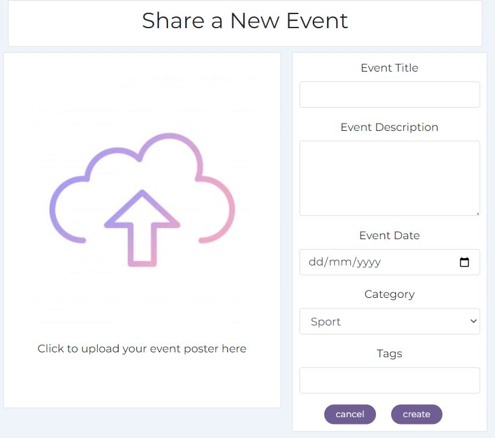

# **Happening**

I live in a small town of around 15,000 people in the south of Spain, where lots of great events happen, but unlike in the big cities, there are no websites or applications dedicated to publicising the event information out to the people.

The most similar browser-based events platform that exists today would be Eventbrite. If I do a search in Eventbrite for events filtered by my town, the closest event is 100Km away. Even though I know there are lots of great events happening every day on my doorstep, there is no single application or website where I can see them. These days, people simply rely on diffusion via Whatsapp groups and posters in the streets. 

Happening provides an interactive platform to create, view, edit and delete event information for a local area. A user who wishes to share an event can upload information about the event, including the date, a description, a category for who it's ideally aimed at, an image or event poster, and keyword tags. A user who wishes to attend events can follow event hosts, show their interest in an event, mark as attending an event, comment on an event and write a review for an event. 

This fictional site was created for Portfolio Project #5 (Advanced Front End) - Diploma in Full Stack Software Development Diploma at the [Code Institute](https://www.codeinstitute.net).

[View live website here](https://happening-react.herokuapp.com/)

## Table of Contents

- [Project](<#project>)
    * [Objective](<#objective>)
    * [Site Users Goal](<#site-users-goal>)
    * [Site Owners Goal](<#site-owners-goal>)
    * [Project Management](<#project-management>)

- [User Experience (UX)](<#user-experience-ux>)
    * [Wireframes](<#wireframes>)
    * [User Stories](<#user-stories>)
    * [Site Structure](<#site-structure>)
    * [Design Choices](<#design-choices>)

- [Existing Features](#features)
  * [Navigation](#navigation)
  * [Authentication](#authentication)
  * [Homepage](#homepage)
  * [Feed](#feed)
  * [My Events](#my-events)
  * [Create an Event](#create-an-event)
  * [Event Detail Page](#event-detail-page)
  * [Reviews](#reviews)
  * [Profile Page](#profile-page)
  * [Contact](#contact)
  * [Feed](#feed)
  * [Reusable React Components](#reusable-react-components)

- [Features Left To Implement](<#features-left-to-implement>)

- [Technologies Used](<#technologies-used>)
    * [Languages](<#languages>)
    * [Frameworks & Software](<#frameworks--software>)
    * [Libraries](<#libraries>)
- [Agile Workflow](#agile-workflow)
  * [Github Project Board](#github-project-board)
- [Testing](#testing)
- [Deployment](#deployment)
- [Credits](#credits)

# **Project**

## Objective

The objective of this project is to build a community-based content sharing web application for a small local area allowing users to learn about events happening in the area and to interact with the published content. The platform allows users to view, create, edit, delete, comment and review event postings. The content can be viewed in a logical order,  filtered by category, and searched on by keywords. Users can also follow each other and register their interest in other user's shared content. 

## Site User's Goal

There are primarily two types of users who will be interacting with this platform. Users who host events in the local area, and users who attend events in the local area. Of course there will also be some cross over between the two groups for those who post events but also attend them as well.

The event hosts wants to share the details of upcoming events with as many members of the local community in one single sharing platform and then gauge two things as a result of the post. Prior to the event happening, the user can see how many people are interested in the event or plan to attend the event. They can also read people's comments regarding the event, and receive messages from interested users who have questions. After the event has taken place, they can read reviews given about the event and see individual ratings and an overall average rating for the event. 

All remaining members of the community who are not hosting events, want to find out about all the upcoming events happening in the local area in one single platform. The users can view the full details of each event in an ordered manner, or filter the full list of events based on their personal preferences. Users can show their interest in an event or show they plan to attend. They can write public comments about the event while it is being advertised for others to read, and once the event has taken place they can add a review as well, giving the hosts and other users excellent feedback. If in doubt users can send each other direct messages, or find further contact details within the profile page. 

## Site Owner's Goal

As the site owner, I saw a problem in the town where I live which I have tried to solve with this platform. I want all members of the local community to be able to find out what is happening in the town in a single dedicated platform. However, not only can they simply see all the event posters listed in one place, they also have the ability to interact with the content, share opinions publicly and contact the event organisers. 

## Project Management

### Github Project Board

I've been using the project board in GitHub to keep my project together. In the initial design phase, it was really helpful to plan the project as a whole, and create the user stories based on my wireframe designs. I created a Milestone for each main app created in the backend API plus one additional for Navigation and Authentication, in order to maintain a similar structure to the backend Project Board. Each milestone has a list of bullet points for the main desired frontend features. Then, I created a linked User Story for each feature and gave it a level of prioritization using the MoSCoW method and a number of User Story points to indicate the level of difficulty for that feature.

Later on, during the build, I also used the Project Board to log and track bugs found in my code which could not be fixed immmediately. Where git commits are directly related to a user story, the commit message has been linked to the user story via the hashtag numbering system. 

### Database Schema

All the models have been set up in a separate DRF repository. Click [here](https://github.com/quiltingcode/events-backend-api) to view the repository or [here](https://happening-api-kelz.herokuapp.com/) to view the deployed API.

 
[Back to top](<#table-of-content>)

# **User Experience (UX)**

## Wireframes

The wireframes for the site were created in the software [Balsamiq](https://balsamiq.com). The wireframes have been created principally for desktop devices as this is a browser based platform. However, the wesbite is responsive for tablet and mobile, and I have created additional wireframes to show how the various events pages and profile page adapt to smaller devices. The main grid layout of the components is initially based on the CI Moments walkthrough tutorial as this seems to me the best layout both for wider desktops as for smaller mobile devices for a content sharing platform so I didn't see much reason to change it or find many areas where I could improve on it. Any differences are down to personalised content that fits the project goals.

<b>Wireframes</b>

 

## User Stories
Here I have listed the main user stories for a user who is not logged in, or has no account and a logged in user. These user stories were then tested and confirmed in the [Testing](<#testing>) section.

### Logged Out Site User
|  | | |
|:-------:|:--------|:--------|
| As a Logged out User | I can log in so that I can interact fully with the site | &check; |
| As a Logged out User | I can sign up so that I can interact fully with the site | &check; |
| As a Logged out User | I can see a list of all events so that I can see all events that have been shared to the site | &check; |
| As a Logged out User | I can view a single event so that I can see single event details| &check; |
| As a Logged out User | I can view the top upcoming events so that I know which events have the highest going count | &check; |
| As a Logged out User | I can view the popular profiles so that I can see who has the most followers | &check; |
| As a Logged out User | I can view the details of an individual profile page so that I can see more profile data | &check; |
| As a Logged out User | I can filter events by category so that I can view only the events I'm interested in | &check; |
| As a Logged out User | I can search events by title, profile, date or tag so that I can find one particular event | &check; |
| As a Logged out User | I can view comments of an event so that I can see what other users think about the event | &check; |

### Logged In Site User
|  | | |
|:-------:|:--------|:--------|
| As a Logged in User | I can log in so that I can interact fully with the site | &check; |
| As a Logged in User | I can log out from the site so that no-one else can interact with the site using my details | &check; |
EVENTS
| As a Logged in User | I can see a list of all events so that I can see all events that have been shared to the site | &check;
| As a Logged in User | I can view a single event so that I can see single event details | &check; |
| As a Logged in User | I can view the top upcoming events so that I know which events have the highest going count | &check; |
| As a Logged in User | I can view the feed page so that I can only see events of profiles I follow | &check; |
| As a Logged in User | I can view the My Events page so that I can see only the events i'm interested in or going to | &check; |
| As a Logged in User | I can view the details of an individual profile page so that I can see more profile data | &check; |
| As a Logged in User |  I can see all the events from one profile so that I can view all the events of one profile easily | &check; |
| As a Logged in User | I can filter events by category so that I can view only the events I'm interested in  | &check; |
| As a Logged in User | I can search events by title, profile, date or tag so that I can find one particular event | &check; |
| As a Logged in User | I can create a new event so that I can promote an event in the town| &check; |
| As a Logged in User | I can edit my events so that I can change the details or correct mistakes | &check; |
| As a Logged in User | I can delete my own events so that I can remove events from the site | &check; |
INTERESTED/GOING
| As a Logged in User | I can add interested to a post so that I can publicly display my interest in an event | &check; |
| As a Logged in User | I can remove interested to a post so that I can remove interest in an event if i change my mind | &check; |
| As a Logged in User |  I can add going to an event so that I can publicly show that i plan to attend | &check; |
| As a Logged in User | I can remove going from an event so that I can remove going to an event if i no longer plan to attend | &check; |
COMMENTS
| As a Logged in User | I can view comments of an event so that I can see what other users think about the event | &check; |
| As a Logged in User | I can create a comment so that I can publicly show my thoughts about an upcoming event | &check; |
| As a Logged in User | I can edit my comments so that I can correct mistakes | &check; |
| As a Logged in User | I can delete a comment that I created so that I can remove comments as I see fit | &check; |
| As a Logged in User | I can delete a comment that I created so that I can remove comments as I see fit | &check; |
FOLLOW
| As a Logged in User | I can follow another user so that I can see their events in my feed page | &check; |
| As a Logged in User | I can unfollow another user so that I can stop seeing their events in my feed page | &check; |
REVIEWS
| As a Logged in User | I can view all events that have happened so that I can see their average rating and review count | &check; |
| As a Logged in User | I can view all the reviews relating to a single event so that I can see other user's opinions of the event | &check; |
| As a Logged in User | I can post a review on a past event so that I can share my opinion on the event | &check; |
| As a Logged in User | I can edit my own reviews so that I can correct my comments | &check; |
| As a Logged in User | I can delete a review that I created so that I can remove reviewsI no longer want published | &check; |
PROFILES
| As a Logged in User | I can view the popular profiles so that I can see who has the most followers | &check; |
| As a Logged in User | I can view the profile page of another user so that I can see more details about that user | &check; |
| As a Logged in User | I can edit my own profile page so that I can add additional information for other users to see about me | &check; |
| As a Logged in User | I can change my username and password so that I can change my login details if I feel they are not secure | &check; |
| As a Logged in User | I can change my username and password so that I can change my login details if I feel they are not secure | &check; |
CONTACT
| As a Logged in User | I can view messages in my profile page so that I can read messages other users have sent me | &check; |
| As a Logged in User | I can send a message to another user so that I can ask a question about an event they are hosting | &check; |

[Back to top](<#table-of-content>)

## Site Structure

Happening is split up in two parts: when the user is logged out and when the user is logged in. Depending on login status different pages are available for the user. When the user is logged out the pages: Home, and Sign In or Up are available from the Navigation Bar menu. When the user is logged in Feed, My Events, Reviews, Signout and Profile Page also become available. 

## Design Choices

* ### Color Scheme

When deciding on the colour scheme for my site, I looked at other content sharing platforms such as Facebook, Instagram and Eventbrite for inspiration. All of these use a very neutral color scheme with barely any background colour at all, and then just hints of brand color here and there to let the buttons stand out. In order to follow a similar approach, I chose a very neutral background color and then complimentary pink and purple tones for the icons and buttons. 

* ### Typography

The main font used for the site is 'Montserrat' with a fallback font of Sans-Serif just in case it doesn't load. This font is nice and clear to read even though the platform in general is not text-heavy. 

[Back to top](<#table-of-content>)

# **Existing Features**

* ## Navigation

The navigation bar is very clean and straight forward. Depending on whether you are logged in or not, different menus are visible for the site user. For tablet and mobile devices, the navigation bar menu turns into a hamburger dropdown list. 

On accessing the site for the first time, the user is logged out and the following menu items are visible:

* Happening Logo - On the far left hand side of the navigatin bar is the Happening brand logo. This is visible throughout the site to all user types and contains a link back to the homepage. 
* Home - the first menu item, and the initial default start page, is 'Home', where all events shared among the community are displayed. 
* Authentication - Next is a dropdown menu in the form of a profile icon. Within this dropdown the user has the options to Signin or Signup which takes them to the respective page. 

Once the user logs in, additional links become available to select:

* Feed - Logged in users can access the feed page where they can see events of other profiles they follow.
* My Events - Logged in users can access the My Events dropdown menu where they can view either all the events where they have clicked 'interested' or all the events where they have clicked 'going'.
* Reviews - Logged in users can go to the reviews page and read reviews about events
* Authentication - The icons within the authentication change once a user has logged in, and now display a link to the user's own profile page or a link to sign out of the site. 
* Add Event - Logged in users can access the event creation page to share their own events to the site. 

## Authentication

Users who are new to the site, or haven't previously created an account can click on the Signup Menu option on the Navigation Bar to create a user account.  I have used the standard dj-rest/auth/registration user account signup process for this. 

If a user has a Happening user account, they can click on the Signin menu option in the Navigation Bar to sign into their account.

If the user wishes to sign out, once signed in, the sign out option becomes visible in the Navigation Bar for them to select. 

* ## Homepage

There are four main react components which make up the Home events page. 

1. Popular Profiles Component
2. Events posts
3. Top Upcoming Events
4. Search and Filter

### Popular Profiles Component

The popular profiles component is a permanent feature across the entire site. It appears at the top of all pages. This component uses a filter to order all site users by followers count from highest to lowest. The users with the highest follower count are determined to be the most popular profiles and the top six are displayed within the popular profiles component. 

If the user isn't logged in, they can see avatar, and the username of the top 6 most popular profiles, and if the user is logged in, they will also see a button enabling them to follow or unfollow the profile. 

If the follow button is greyed out, it is because your own profile has made it to the top 6 most popular profiles list, but you are not allowed to follow yourself. Originally, it was simply the case that no button appeared under your own profile but aesthetically, this didn't look good and the component didn't look balanced, so I decided to put an inactive button with a tooltip there instead. 

Each profile avatar can be clicked on to view the full profile page of that user. 

### Events Posts

All events that are created through the Happening sharing platform are displayed on the Homepage. All events created are requested from the API and they are ordered by the created date starting with the most recently posted and working backwards. 

Each event posting displays the user who shared it and the date it was shared. The event poster is in the center, and underneath are the event details. In bold, you can see the event title and the date it's going to take place. Next is a description of the event, and the tags.

Each event has three counts shown - A count of people interested in the event, a count of people planning on going to the event, and a count of comments users have posted about this event. 

The first two counts work on a toggle system but in addition to this, they are also mutually exclusive. You can click the interested button on and off to make the count go up and down. Equally, you can click the going button on and off to make the count go up and down. However, if you have previoulsy clicked interested, and now you've decided to attend the event, by clicking the going button, the interested count automatically goes down by 1 as the going count goes up by 1. And vice versa. You can't be both interested and going to an event. It must be one or the other. 

By clicking on the event image or the comments count, the user is taken to the event details page.

### Top Upcoming Events

The third component of the events page is the Top Upcoming Events component. In desktop view, this is shown next to the popular profiles and events, and on tablet and mobile devices, this component moves over into the center and is displayed between the popular profiles and the events. 

This component uses two filters: The first filter comes from the API and orders all site events by going count from highest to lowest. Next, I used a Javascript filter on the frontend results to check the event date, and filter out any events where the event_date field is in the past. There is no point continually promoting fantastic events which have already taken place. Finally, on smaller devices I've taken just the top five results so that it fits better on smaller screens. 

If you click on any of the top events listed, you are taken to the event details page.

### Search and Filter

If the user wants to search for specific events or an event, they have two ways to achieve this:

1. All events are assigned a category on creation, and so the events list can be filtered by these categories to show only the events in one category selected by the user from the dropdown options. 

2. Search - The user can search all the events listed by event title, username who posted it, event date, or event tags. This search can be used in conjunction with the category filter or independently, but when the site has a lot of shared events, using both search and filter together makes the overall search facility much more efficient. 

* ## Feed

The feed page looks identical to the homepage, only the Events Posts component changes. In this page all the events are requested from the API, but then a filter is used to only show events posted by profiles that the currently logged in user is following. For this reason, this page doesn't work if the user is not logged in. Equally, if the user isn't following any other profiles, no events will be displayed and a 'No Results found' message will appear instead inside the events posts component. 

* ## My Events

The My Events page looks identical to the homepage, only the Events Posts component changes. On selecting the My Events menu option in the NavBar, you are shown a dropdown with two additional options. Interested or Going. If you select interested, the events posts component will be filtered to only show the events where the logged in user has clicked the interested button. Alternatively, if the user selects the going option from navbar dropdown, the filter changes to only show events where the logged in user has clicked the going button. 

In the original plan for this project, I wanted the My Events page to be a combination of all the events where the user has selected either interested or going on an event. Initially, I tried to set up the backend API and display both these filters at the same time, but I couldn't join the two filterset fields together. I asked among the slack community and others had achieved adding two filters together with an AND command, but nobody seemed to know how to do an OR command. I consulted my mentor further into the project when I had the frontend up and running and he was also unsure how this could be achieved and suggested I just add an additional filter dropdown to toggle between the two for now. 

* ## Create an Event

If you are logged in, you are able to share new events with the community. By clicking on the Add Event menu option in the Navigation Bar, you are taken to the Share a New Event page, where you can submit the event creation form to the API.

All fields are mandatory apart from the event description (which may be understood from the event poster image that is uploaded) and an image must be uploaded for the event to be submitted successfully. Once the form has been submitted successfully, you can see the event published successfully as you are re-directed automatically to the newly created event details page. 

Each time you share a new event with the community, your events count goes up on your profile page for other users to see how active you are as an event host. 

* ## Event Detail Page

In the event details page, this simply shows everything relating to one single event. You can reach this page by clicking on an event image in any of the events pages or on the event title in the Top Upcoming Events component and Reviews page. It also shows the popular profiles component and the Top Upcoming Events component for continuity across the pages. If you are the owner of the event, from this page you have the option to edit or delete the event by clicking on the three dots that appear next to the event posted date. 

If you select Edit, you are taken back to the event creation form, but the fields are already pre-populated with the existing event information. You can edit the desired fields and save the changes, which will return you to the event detail page and you can see that the event has been updated successfully. 

If you select Delete, a pop-up message appears asking you if you are sure you want to delete this event. This defensive design component allows the user to cancel out of the deletion process if the button was pressed in error. If however, the user wishes to proceed with the deletion they can click confirm and the event will be removed from all pages and the user redirected back to the previously visited page. 

Below the event details is the comments section. If there are no comments yet, the user will see a message telling them that there are no comments. 

If the user is not logged in, they can read any comments that have been posted but they can't post a comment themselves unless they log in. 

Any comments that have been posted about this event are displayed, regardless of login status. If the user logs in they will see a comment form above the existing comments where they can post their own comment to the event. 

* ## Reviews
* ## Profile Page
* ## Contact
* ## Feed
* ## Reusable React Components

### Three Dots Edit Delete Dropdown Menu
### Delete Confirmation Component
### Date Formatter Component
### Alert Component

[Back to top](<#table-of-content>)