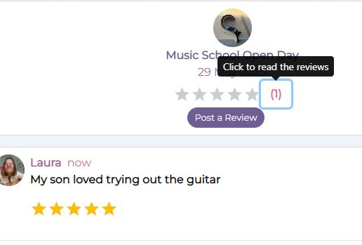

# **Happening**

# Frontend Testing

## Table of Contents

* [**Testing**](<#testing>)
    * [Code Validation](<#code-validation>)
    * [Automatic Testing](<#automatic-testing>)
    * [Manual Testing](<#manual-testing>)
    * [Responsiveness Testing](<#responsiveness-testing>)
    * [Lighthouse Testing](<#lighthouse-testing>)
    * [Known Bugs](<#known-bugs>)

## Code Validation 

The Happening site has been passed through the [W3C html Validator](https://validator.w3.org/), the [W3C CSS Validator](https://jigsaw.w3.org/css-validator/) and the [ESLint Validator](https://eslint.org/docs/latest/use/getting-started#next-steps).

### W3C HTML Validation Results

No errors were found when the deployed Happening URL was passed through W3C HTML validation checker. Only some lines of info were noted regarding the standard Meta code in the index.html file. 

### W3C CSS Validation Results

No errors or warnings were found when the deployed Happening URL was passed through the W3C CSS Validation checker.

### ESLint Validation Results

After resolving the errors caused where files, by default, had react imported but not used, only 9 errors regarding the testing files, so I have left these, and subsequently uninstalled ES Lint as it was causing conflicts with the dependency tree. 

## Automatic Testing

The following Jest automatic tests have been written to check that the main frontend components render correctly: 

### NavBar.js
|  | | |
|:-------:|:--------|:--------|
| Renders Navbar Home link| &check; |
| Renders link to the feed page for a logged in user | &check; |
| Renders link to the reviews page for a logged in user | &check; |

### NotFound.js
|  | | |
|:-------:|:--------|:--------|
| Go Back to homepage link renders | &check; |

### Avatar.js
|  | | |
|:-------:|:--------|:--------|
| Avatar renders | &check; |

### Event.js
|  | | |
|:-------:|:--------|:--------|
| Renders event component | &check; |
| Event owner avatar renders | &check; |

## Manual Testing

As well as the automatic tests, I carried out the following additional manual tests to check all the user story scenarios:

| Status | **Authentication - User Logged Out**
|:-------:|:--------|
| &check; | Typing 'https://happening-react.herokuapp.com/feed' url into the browser, the user can not access the feed page. User is redirected Home
| &check; | Typing 'https://happening-react.herokuapp.com/myevents/going' url into the browser, the user views the homepage events feed
| &check; | Typing 'https://happening-react.herokuapp.com/myevents/interested' url into the browser, the user views the homepage events feed
| &check; | Typing 'https://happening-react.herokuapp.com/reviews' url into the browser, the user is redirected back to the homepage
| &check; | Typing 'https://happening-react.herokuapp.com/events/create' url into the browser, the user is redirected back to the homepage
| &check; | Typing 'https://happening-react.herokuapp.com/profiles/{id}/edit' url into the browser, the user is redirected back to the homepage
| &check; | Typing 'https://happening-react.herokuapp.com/events/{id}/edit' url into the browser, the user is redirected back to the homepage
| &check; | Desktop and tablet users can see an image next to the sign in form
| &check; | Mobile users can't see an image next to the sign in form
| &check; | Desktop and tablet users can see an image next to the sign up form
| &check; | Mobile users can't see an image next to the sign up form

| Status | **Navigation - User Logged Out**
|:-------:|:--------|
| &check; | Clicking the navbar brand logo loads the home page
| &check; | Clicking the Home button on the nav bar re-loads the home page
| &check; | Clicking the Sign In button on the nav bar loads the sign up page
| &check; | Clicking the Sign Up button on the nav bar loads the sign in page
| &check; | The user can not see the profile page link in the navigation bar profile section dropdown menu
| &check; | The user can not see the sign out link in the navigation bar profile section dropdown menu
| &check; | Users can not see the Feed menu option in the navigation bar
| &check; | Users can not see the My Events menu option in the navigation bar
| &check; | Users can not see the Reviews menu option in the navigation bar
| &check; | Users can not see the 'Add Event' button in the navigation bar
| &check; | Tablet and mobile users can see the navigation bar options in a burger menu dropdown
| &check; | Clicking a link from the navigation bar links automatically closes the burger menu
| &check; | User can not sign in with false credentials - warning message displayed
| &check; | User can not sign in without filling out all the input fields - warning message displayed
| &check; | User can not sign up without filling out all the input fields - warning message displayed
| &check; | User can not sign up if the two password fields don't match - warning message displayed
| &check; | User can not sign up if the username chosen already exists in the database - warning message displayed

| Status | **Homepage - User Logged Out**
|:-------:|:--------|
| &check; | Users can view the Popular Profiles component
| &check; | Users can not view the follow button under each Popular Profile
| &check; | Clicking on a popular profile avatar, users are redirected to the selected profile page
| &check; | Desktop and tablet users can view the Top Events component on the right
| &check; | Mobile users can view the Top Events component under the Popular Profiles component.
| &check; | Clicking on a top event title, users are redirected to the selected event detail page
| &check; | Users can view all events - title, description, event date, image and tags
| &check; | Users can view the interested count
| &check; | Users can view the going count
| &check; | Users can view the comments count
| &check; | Clicking on an event image, users are redirected to the selected event detail page
| &check; | Clicking on an event comments count, users are redirected to the selected event detail page
| &check; | Clicking on an event owner avatar, users are redirected to the selected profile page
| &check; | Users can search for a particular event by typing in the event title, the username of the event owner, the event date, or the event tag
| &check; | Users can filter the list of events by selecting a category from the category dropdown

| Status | **Event Detail Page - User Logged Out**
|:-------:|:--------|
| &check; | Users can view the Popular Profiles component
| &check; | Clicking on a popular profile avatar, users are redirected to the selected profile page
| &check; | Desktop and tablet users can view the Top Events component on the right
| &check; | Mobile users can view the Top Events component under the Popular Profiles component.
| &check; | Clicking on a top event title, users are redirected to the selected event detail page
| &check; | Users can view details of a single event
| &check; | Clicking on an event owner avatar, users are redirected to the selected profile page
| &check; | Clicking on the interested button, users are advised to logout to register their interest in the event
| &check; | Clicking on the going button, users are advised to logout to show they are going to the event
| &check; | Users can view any published comments posted about this event
| &check; | Users can not see the create comment form

| Status | **Profile Page - User Logged Out**
|:-------:|:--------|
| &check; | Users can view the Popular Profiles component
| &check; | Clicking on a popular profile avatar, users are redirected to the selected profile page
| &check; | Desktop and tablet users can view the Top Events component on the right
| &check; | Users can view the number of events the profile owner has posted
| &check; | Users can view the number of events the profile owner has attended
| &check; | Users can view the number of followers the selected profile has
| &check; | Users can view the number of other profiles the selected profile is following
| &check; | Users can view the events which were posted by the selected profile
| &check; | Clicking on the event image, users are redirected to the selected event detail page
| &check; | Clicking on the interested button, users are advised to logout to register their interest in the event
| &check; | Clicking on the going button, users are advised to logout to show they are going to the event
| &check; | Clicking on an event comments count, users are redirected to the selected event detail page
| &check; | Clicking on a url in the contact details section will open the web page in a new browser tab.

| Status | **Navigation - User Logged In**
|:-------:|:--------|
| &check; | Clicking the navbar brand logo loads the home page
| &check; | Clicking the Home button on the nav bar re-loads the home page
| &check; | User can't see the sign in button in the navigation bar profile section dropdown menu
| &check; | User can't see the sign up button in the navigation bar profile section dropdown menu
| &check; | The user can see the profile page link in the navigation bar profile section dropdown menu
| &check; | The user can see the sign out link in the navigation bar profile section dropdown menu
| &check; | Users can see the Feed menu option in the navigation bar
| &check; | Users can see the My Events menu dropdown in the navigation bar
| &check; | Users can see the Reviews menu option in the navigation bar
| &check; | Users can see the 'Add Event' button in the navigation bar
| &check; | Tablet and mobile users can see the navigation bar options in a burger menu dropdown
| &check; | Clicking a link from the navigation bar links automatically closes the burger menu
| &check; | User can view their avatar image next to the profile page link

| Status | **Homepage - User Logged In**
|:-------:|:--------|
| &check; | Users can view the Popular Profiles component
| &check; | Clicking on a popular profile avatar, users are redirected to the selected profile page
| &check; | Users can view the follow button under each Popular Profile
| &check; | Clicking on a popular profile follow button, users can become a follower of the selected profile
| &check; | Desktop and tablet users can view the Top Events component on the right
| &check; | Mobile users can view the Top Events component under the Popular Profiles component.
| &check; | Clicking on a top event title, users are redirected to the selected event detail page
| &check; | Users can view all events posted to the site - title, description, event date, image and tags
| &check; | Users can view the interested count
| &check; | Users can view the going count
| &check; | Users can view the comments count
| &check; | Clicking on an event image, users are redirected to the selected event detail page
| &check; | Clicking on the interested button, interested count goes up and down on a toggle
| &check; | If the logged in user is the event owner, user can not click the interested button - tooltip warning given
| &check; | Clicking on the going button, going count goes up and down on a toggle
| &check; | If the logged in user is the event owner, user can not click the going button - tooltip warning given
| &check; | If the user clicks interested, having previously clicked going, the interested count goes up, and the going count goes down.
| &check; | If the user clicks going, having previously clicked interested, the going count goes up, and the interested count goes down.
| &check; | Clicking on an event comments count, users are redirected to the selected event detail page
| &check; | Clicking on an event owner avatar, users are redirected to the selected profile page
| &check; | Users can search for a particular event by typing in the event title, the username of the event owner, the event date, or the event tag
| &check; | Users can filter the list of events by selecting a category from the category dropdown

| Status | **Add Event Page - User Logged In**
|:-------:|:--------|
| &check; | Users can view the empty form to create a new event
| &check; | Users can upload an image into the form
| &check; | Users can change an uploaded image
| &check; | Users can't submit the form without an image - warning message displayed
| &check; | Users can't submit the form without at least one tag - warning message displayed
| &check; | Users can't submit the form without filling out the event title field - warning message displayed
| &check; | Users can't submit the form without selecting an event date - warning message displayed

| Status | **Feed - User Logged In**
|:-------:|:--------|
| &check; | Users can view the Popular Profiles component
| &check; | Clicking on a popular profile avatar, users are redirected to the selected profile page
| &check; | Users can view the follow button under each Popular Profile
| &check; | Clicking on a popular profile follow button, users can become a follower of the selected profile
| &check; | Desktop and tablet users can view the Top Events component on the right
| &check; | Mobile users can view the Top Events component under the Popular Profiles component.
| &check; | Clicking on a top event title, users are redirected to the selected event detail page
| &check; | Users can view all events posted by profiles they follow - title, description, event date, image and tags
| &check; | Users can view the interested count
| &check; | Users can view the going count
| &check; | Users can view the comments count
| &check; | Users see a new results found message if they dont' follow any profiles, or the profiles they follow haven't posted any events
| &check; | Clicking on an event image, users are redirected to the selected event detail page
| &check; | Clicking on the interested button, interested count goes up and down on a toggle
| &check; | If the logged in user is the event owner, user can not click the interested button - tooltip warning given
| &check; | Clicking on the going button, going count goes up and down on a toggle
| &check; | If the logged in user is the event owner, user can not click the going button - tooltip warning given
| &check; | If the user clicks interested, having previously clicked going, the interested count goes up, and the going count goes down.
| &check; | If the user clicks going, having previously clicked interested, the going count goes up, and the interested count goes down.
| &check; | Clicking on an event comments count, users are redirected to the selected event detail page
| &check; | Clicking on an event owner avatar, users are redirected to the selected profile page
| &check; | Users can search for a particular event by typing in the event title, the username of the event owner, the event date, or the event tag
| &check; | Users can filter the list of events by selecting a category from the category dropdown

| Status | **My Events - Going - User Logged In**
|:-------:|:--------|
| &check; | Users can view the Popular Profiles component
| &check; | Clicking on a popular profile avatar, users are redirected to the selected profile page
| &check; | Users can view the follow button under each Popular Profile
| &check; | Clicking on a popular profile follow button, users can become a follower of the selected profile
| &check; | Desktop and tablet users can view the Top Events component on the right
| &check; | Mobile users can view the Top Events component under the Popular Profiles component.
| &check; | Clicking on a top event title, users are redirected to the selected event detail page
| &check; | Users can view all events where they have clicked the going button - title, description, event date, image and tags
| &check; | Users see a new results found message if they haven't clicked going on any event postings
| &check; | Users can view the interested count
| &check; | Users can view the going count
| &check; | Users can view the comments count
| &check; | Clicking on an event image, users are redirected to the selected event detail page
| &check; | Clicking on the interested button, interested count goes up and the going count goes down
| &check; | Clicking on the going button, going count goes up and down on a toggle
| &check; | Clicking on an event comments count, users are redirected to the selected event detail page
| &check; | Clicking on an event owner avatar, users are redirected to the selected profile page
| &check; | Users can search for a particular event by typing in the event title, the username of the event owner, the event date, or the event tag
| &check; | Users can filter the list of events by selecting a category from the category dropdown

| Status | **My Events - Interested - User Logged In**
|:-------:|:--------|
| &check; | Users can view the Popular Profiles component
| &check; | Clicking on a popular profile avatar, users are redirected to the selected profile page
| &check; | Users can view the follow button under each Popular Profile
| &check; | Clicking on a popular profile follow button, users can become a follower of the selected profile
| &check; | Desktop and tablet users can view the Top Events component on the right
| &check; | Mobile users can view the Top Events component under the Popular Profiles component.
| &check; | Clicking on a top event title, users are redirected to the selected event detail page
| &check; | Users can view all events where they have clicked the interested button - title, description, event date, image and tags
| &check; | Users see a new results found message if they haven't clicked interested on any event postings
| &check; | Users can view the interested count
| &check; | Users can view the going count
| &check; | Users can view the comments count
| &check; | Clicking on an event image, users are redirected to the selected event detail page
| &check; | Clicking on the going button, going count goes up and the interested count goes down
| &check; | Clicking on the interested button, interested count goes up and down on a toggle
| &check; | Clicking on an event comments count, users are redirected to the selected event detail page
| &check; | Clicking on an event owner avatar, users are redirected to the selected profile page
| &check; | Users can search for a particular event by typing in the event title, the username of the event owner, the event date, or the event tag
| &check; | Users can filter the list of events by selecting a category from the category dropdown

| Status | **Event Detail Page - User Logged In**
|:-------:|:--------|
| &check; | Users can view the Popular Profiles component
| &check; | Clicking on a popular profile avatar, users are redirected to the selected profile page
| &check; | Desktop and tablet users can view the Top Events component on the right
| &check; | Mobile users can view the Top Events component under the Popular Profiles component.
| &check; | Clicking on a top event title, users are redirected to the selected event detail page
| &check; | Users can view details of a single event - title, description, event date, image and tags
| &check; | Users can view the interested count
| &check; | Users can view the going count
| &check; | Users can view the comments count
| &check; | Clicking on an event owner avatar, users are redirected to the selected profile page
| &check; | Clicking on the interested button, interested count goes up and down on a toggle
| &check; | If the logged in user is the event owner, user can not click the interested button - tooltip warning given
| &check; | Clicking on the going button, going count goes up and down on a toggle
| &check; | If the logged in user is the event owner, user can not click the going button - tooltip warning given
| &check; | If the user clicks interested, having previously clicked going, the interested count goes up, and the going count goes down.
| &check; | If the user clicks going, having previously clicked interested, the going count goes up, and the interested count goes down.
| &check; | Users can view any published comments posted about this event
| &check; | Users can view the create comment form
| &check; | Users can type into the comment form and submit a comment to the event
| &check; | On submitting a comment, the comment count increases by 1
| &check; | If the logged in user is the owner of a published comment, they can see the three dots edit/delete menu next to it
| &check; | User can edit their own comments via the three dots edit/delete menu
| &check; | User can delete their own comments via the three dots edit/delete menu
| &check; | On clicking delete comment, user is presented with a modal popup to confirm the deletion request
| &check; | On deleting a comment, the comment count decreases by 1
| &check; | If the logged in user is the owner of the event, they can see the three dots edit/delete menu next to the created_at date
| &check; | User can edit their own events via the three dots edit/delete menu
| &check; | On clicking edit event, user is redirected to the edit events page
| &check; | User can delete their own events via the three dots edit/delete menu
| &check; | On clicking delete event, user is presented with a modal popup to confirm the deletion request

| Status | **Edit Event Page - User Logged In**
|:-------:|:--------|
| &check; | Users can view the event form pre-populated with the current event details
| &check; | Users can upload an image into the form
| &check; | Users can change an uploaded image
| &check; | Users can't submit the form without an image - warning message displayed
| &check; | Users can't submit the form without at least one tag - warning message displayed
| &check; | Users can't submit the form without filling out the event title field - warning message displayed
| &check; | Users can't submit the form without selecting an event date - warning message displayed

| Status | **Reviews - User Logged In**
|:-------:|:--------|
| &check; | Users can view the Popular Profiles component
| &check; | Clicking on a popular profile avatar, users are redirected to the selected profile page
| &check; | Users can view the follow button under each Popular Profile
| &check; | Clicking on a popular profile follow button, users can become a follower of the selected profile
| &check; | Desktop and tablet users can view the Top Events component on the right
| &check; | Mobile users can view the Top Events component under the Popular Profiles component.
| &check; | Clicking on a top event title, users are redirected to the selected event detail page
| &check; | Users can view all events with an event date lesser than or equal to today - event owner avatar, event title, event date, average rating, reviews count
| &check; | Clicking on an event title, users are redirected to the selected event detail page
| &check; | Clicking on an event owner avatar, users are redirected to the selected profile page
| &check; | Users can search for a particular event by typing in the event title, the username of the event owner, the event date, or the event tag
| &check; | Users can filter the list of events by selecting a category from the category dropdown
| &check; | Clicking on the reviews count, will toggle open and closed the individual published reviews for the selected event
| &check; | Users can view a 'Post a Review' button
| &check; | Clicking on the 'Post a Review' button will open a modal popup to create a review
| &check; | Users own the event will receive a tooltip warning if they click the 'Post a Review' button saying 'You can't review your own event'
| &check; | Users who have already reviewed the event will receive a tooltip warning if they click the 'Post a Review' button saying 'You have already reviewed this event'
| &check; | Users receive a warning message if they try to submit a review without any comments
| &check; | On submitting a review, the review count increases by 1
| &cross; | On submitting a review, the average rating is recalculated
| &check; | If the logged in user is the owner of the review, they can see the three dots edit/delete menu next to it
| &check; | User can edit their own review comments via the three dots edit/delete menu
| &check; | On clicking edit review, user can view a popup with the review comments field pre-populated to edit.
| &check; | On clicking save in the edit review popup, the review is automatically updated with the amended comments
| &check; | User can delete their own reviews via the three dots edit/delete menu
| &check; | On clicking delete review, user is presented with a modal popup to confirm the deletion request
| &check; | On deleting a review, the review count decreases by 1

| Status | **Profile Page - User Logged In**
|:-------:|:--------|
| &check; | Users can view the Popular Profiles component
| &check; | Clicking on a popular profile avatar, users are redirected to the selected profile page
| &check; | Users can view the number of events the profile owner has posted
| &check; | Users can view the number of events the profile owner has attended
| &check; | Users can view the number of followers the selected profile has
| &check; | Users can view the number of other profiles the selected profile is following
| &check; | Users can view the events which were posted by the selected profile
| &check; | Clicking on the event image, users are redirected to the selected event detail page
| &check; | Clicking on the interested button, interested count goes up and down on a toggle
| &check; | If the logged in user is the event owner, user can not click the interested button - tooltip warning given
| &check; | Clicking on the going button, going count goes up and down on a toggle
| &check; | If the logged in user is the event owner, user can not click the going button - tooltip warning given
| &check; | If the user clicks interested, having previously clicked going, the interested count goes up, and the going count goes down.
| &check; | If the user clicks going, having previously clicked interested, the going count goes up, and the interested count goes down.
| &check; | Clicking on an event comments count, users are redirected to the selected event detail page
| &check; | Clicking on a url in the contact details section will open the web page in a new browser tab.
| &check; | If the user is viewing their own profile page, they can see the three dots edit profile menu next to the profile stats
| &check; | Users can edit their own profile page via the three dots edit/delete menu
| &check; | On clicking edit profile, user is redirected to the edit profile page
| &check; | User can edit their own username via the three dots edit profile menu
| &check; | User can edit their own password via the three dots edit profile menu
| &check; | If the user is viewing their own profile page, they can view their personal messages inbox
| &check; | In the messages inbox, users can view all messages received by other users - sender username, date sent, and message content
| &check; | Clicking on the 'reply' button of a particular message, the user can send a reply message back to the original sender in a popup modal message form
| &check; | Users receive a success alert message when a reply has been successfully sent to another user
| &check; | If the user is viewing someone else's profile page, they can see a form to send that profile user a message
| &check; | Users can't send a blank message to another profile user - warning message displayed
| &check; | Users receive a success alert message when a message has been successfully sent to another user

| Status | **Edit Profile Page - User Logged In**
|:-------:|:--------|
| &check; | Users can view the profile form pre-populated with the current profile details
| &check; | Users can upload an avatar image into the form
| &check; | Users can change the uploaded image
| &check; | Users must submit a valid URL into the URL fields - warning message displayed
| &check; | Users must submit a valid email address format into the email address field - warning message displayed
| &check; | Users must input only integers into the phone number field - warning message displayed

## Responsiveness Testing

The responsive design tests were carried out manually throughout the build using Google Chrome Dev Tools. I based the main design around a desktop view, as this is primarily a browser based platform, although I have added responsive design for tablet and mobile devices as well. 

During the testing process I also used the [Responsive Design Checker](https://www.responsivedesignchecker.com/) website to simulate the website on several other devices. Here are my findings:

### Mobile Devices

||
iPhone 6/6s/7

375 x 667
|
Samsung Galaxy S5/6/7

360 x 640
|
Google Pixel/Nexus 5

411 x 731
|
| :- | :-: | :-: | :-: |
|Render|Pass |Pass|Pass|
|Images|Pass|Pass|Pass|
|Links|Pass|Pass|Pass|

1. During mobile iPhone testing, I realised that the modal popup for change password doesn't close correctly when you click the cancel button, only the page behind changes but the modal stays open until the third click. I changed the onClick function on the cancel button from history.goBack() to handleClosePasswordModal. This now uses the came close function as the change username modal. 

### Tablet Devices

||
Amazon Kindle Fire

768 x 1024
|
Samsung Galaxy Tab 10

800 x 1280
|
Apple iPad Pro

1366 x 1024

|
| :- | :-: | :-: | :-: |
|Render|Pass|Pass|Pass |
|Images|Pass|Pass|Pass|
|Links|Pass|Pass|Pass|

1. When I click on the category dropdown the options appear in a select box way off the screen in the [Responsive Simulator Website](https://www.responsivedesignchecker.com/). But then if I replicate the same action on Google dev tools with the same Samsung Galaxy Tab dimensions of 800 x 1280 the dropdown appears OK below the header. I think this is just a glitch in the Response Checker website.

2. (Bug #61) On the Apple iPad PRO, when I add an Instagram and Facebook URL to a profile, the URL is too long and it goes out of the Profile Stats Container. 

Solution: I have reduced the font-size of the url text fields as no-one really needs to read them, usually just click on them or copy and paste them somewhere. I have also added the CSS class word-break: break-all to wrap the text down to the next line when it starts to overflow. 

### Desktop Devices

||
24“ Desktop

1920 x 1200
|
19” Desktop

1440 x 900
|
10” Notebook

1024 x 600
|
| :- | :-: | :-: | :-: |
|Render|Pass|Pass|Pass|
|Images|Pass|Pass|Pass|
|Links|Pass|Pass|Pass|

### Browser Compatibility 

Happening was tested on the following browsers:

- Google Chrome
- Microsoft Edge
- Mozilla Firefox

I do not have any Apple devices available to carry out testing on a Safari browser. Appearance and functionality appear to be consistent throughout all browsers. The site loads correctly on Firefox but it doesn't seem to be able to connect with the backend API and get the data. This is something I need to look at for the future to make sure that Firefox users can view my site.

## Lighthouse Testing

Google Lighthouse in Chrome Developer Tools was used to test the application within the areas of *Performance*, *Accessibility*, *Best Practices* and *SEO*. The testing showed the following:

* Home Page - Performance: 70, Accessibility: 95, Best Practises: 83, SEO: 100

### Peer Review

In addition to the above tests, I asked my peers to create a profile and interact with the site and their overall response was very positive and that this platform is something they would love to use on a day to day basis.

## Known Bugs

### Resolved

1. Having run the ESLint program from, the report came out with 40 errors, but no warnings. 

The majority of the errors were caused due to the automatic import of 'react' into each js file, where in many in the end it is not used. I removed all of these imports, which left 9 errrors remaining. These 9 errors were caused by undefined variables in the jest test files, which I am ignoring as they are only test files. 

As I was building the project, I logged all major bugs that could not be immediately resolved as a GitHub issue, and tracked the progress of these through the GitHub project board alongside my user stories. See my GitHub Bug Log [here](https://github.com/quiltingcode/happening-react-frontend/issues?q=is%3Aopen+is%3Aissue+label%3Abug)

2. (Bug #30) There is a known issue with the React Bootstrap mobile Navbar.Collapse burger menu that when an item is selected, it doesn't automatically close. Initially I followed the fix given in the CI Moments walkthrough and created the use ClickOutsideToggle.js component to fix this issue. However, this fix does not handle additional dropdown menus, only a simple list of links, and for example where all my authentication menu options (profile, sign in, sign up and sign out) are in a separate dropdown, on mobile devices I couldn't access these options as the burger menu would close on selecting the dropdown header. 

Solution: I created a toggle function and applied it to each individual menu item that contained a link but not to the menu items that dropped down to show the links. Therefore it doesn't just close on any click but only clicks on links. Clicking anywhere outside of the burger menu doesn't close it but I think it's OK to leave it without this extra functionality.

3. (Bug #32) If the user has already clicked going, if they click interested, it needs to reduce the going count and increase the interested count at the same time. I have managed to get this work, but you have to refresh the page manually to see the new counts. I tried to use an axios promise to make the two axios requests to the going and interested tables simultaneously but this didn't work. I tried to make two separate functions with axios requests, but that didn't work either.

Solution: I made one axios request and then within this function, I called the other decrease count method to make the other axios request. This seems to be working better and both counts are updating automatically without a page refresh.

4. (Bug #33) On the creation of a new event, even though I correctly select a date from the event date calendar field, when the event is saved the event date reverts to being the same as the created_at date. This has occurred since I attempted to make a change to the backend to format the event_date field to display 4th May 2023 instead of 2023-05-04 for example. I then found further issues when I tried to edit an existing event, and the formatted date couldn't be read to pre-populate the event_date field.

Solution: I undid the changes on the backend to fix these problems, and I created a DateFormatter react component on the frontend instead to display the dates nicely to the user.

5. (Bug #45) I pulled through all the events to display on the reviews page, but they were not listed in order of the event_date, but in order of the created_at date just like on the home, feed, and my events pages. This is not what I wanted. 

Solution: In App.js where the filter for this page is set, I had coded '&ordering=-event_date' instead of '?ordering=-event_date'. Once this was changed the list ordered itself correctly. 

6. (Bug #47) When a user deletes a review, the review is deleted but the review count and the average rating on the corresponding event does not update automatically. It only updates when the page is refreshed. In one case, a different count went down in testing, so it seems that it doesn't know the id of the correct event to update. 

Solution: I made a change in the props to differentiate between the review ID and the event ID, as the handle delete function was getting confused between the two I think. The delete functions seems to work correctly now and updates the review count on the corresponding event. Still haven't managed to update the average rating yet though, as I can't work out what the sum would be to recalculate this in the same way we do with the count. In the end, I set the page to refresh, so that all the counts are updated correctly when a review is deleted. 

7. (Bug #48) I can pull through the current star rating into the edit review form, but when I try to change the rating, the screen freezes and I get an error in the console. This star rating component doesn't seem to work well with the handle change of the name attribute which the walkthrough uses to update pre-populated fields for editing, as it won't accept a name attribute at all.

Solution: I decided that in the edit popup the user can only edit the review comments they made, but not the star reating, as I'm not able to change the functions of this react component package. If the user wants to change the star rating a tooltip suggests they delete the whole review and start again from scratch. 

8. (Bug #51) The Top Upcoming Events Component is shown in two places, depending on what device you are viewing the site with. In desktop, you see the component on the right hand side, but on mobile devices you see the component under the popular profiles component. Regardless of where the component is displayed, it should always contain the same top 5 events. However, the mobile popular events component was only showing two events, whereas the desktop version was showing 4. 

Solution: On the mobile popular events component I moved the slice method to go after the date filter, so that it filters by future date first and only then it slices out the top 5 results. Otherwise, sometimes it was slicing 5 results and then out of those only two of the events were in the future so those were being filtered out as well, leaving a different set of results showing to the user. 

9. (Bug #52) I used this [Stack Overflow](https://stackoverflow.com/questions/53772417/react-how-to-filter-events-according-to-date) article to filter all the events postings, and only show the events which have an event_date in the future. However, since this article was written it seems that in more recent coding practice, you should always follow 'new Date' with a set of brackets, which weren't included in the original article, otherwise it throws up a warning in the console. 

Solution: I added the brackets after new Date() and the warnings in the console disappeared but the filter still worked correctly. 

10. (Bug #54) If a user tried to post a second review to an event, I could see a 400 bad request error in the console and the review would not post successfully. This behaviour is correct as I set the backend rules to unique_together for a user and an event when posting a review, and I added a conditional tooltip to warn the user if they tried to click on 'Post a Review' when they had already posted one previously (similar to the like_id ? conditional in the walkthrough) but this doesn't seem to be working. 

Solution: I have looked at the API, and I see the issue. The event instance has an interested ID, and a going ID, but it doesn't have a review ID. So when I set up the ternary conditional the same as the interested/going check to check whether the event already has a review posted to it or not, it will never come back with true as I didn't set up this field on the event serializer. Once I added this field, the conditional ternary started working immediately and the warning tooltip appeared correctly when review_id came back true. 

11. (Bug #55) when a logged out user goes into the profile page of another user, they can see the create message form. They can type in the box and click the send button. Nothing happens on the user interface, but I see a 401 unauthorised message appear in the console, and this access should not be allowed for logged out users.

Solution: Extra conditional added for currentUser? - Logged out users can no longer see the create message form. Mobile logged out users just see the popular profiles component and the profile stats. Desktop users will see the top upcoming events component instead of the create message form on the right hand side. 

12. (Bug #57) Once more and more events data was created with future event dates, the reviews page stopped being able to display all the past events. When the axios request gets all the events data, and then a filter on the front end removes any events with a future date, sometimes out of the first 10 results it sorts through (as it only does 10 at a time) it only finds one or two events, and maybe further down the line it won't find any on that first page. Due to this, the functionality existing in the infinite scroll component doesn't kick in on desktop devices( it does on mobile and shows a scroll to force the spinner icon to load page two) and so no further past events are shown. 

Solution: I found an article on [Stack Overflow](https://stackoverflow.com/questions/58837940/django-rest-framework-filter-by-date-range) which helped me to build the filter on the event date into the backend API before the events are requested from the front end axios request. I added an 'lte' filterset onto the events view so that when axios pulls through the first 10 events, they are already filtered and all 10 will be in the past. In future, I could use this same functionality alongside 'gte' to refactor my top upcoming events component as well. 

13. (Bug #58) When a new review is posted, the review count goes up, but the average rating does not change until the page is refreshed. I can't figure out what is the calculation to use for the average rating field. At the moment I have (Average Rating + new Rating) / Review count - but this is technically not correct. It shouldn't be average rating, it should look at all existing reviews and add the individual ratings together from scratch and then re-average them all at the same time. Otherwise, a different result is produced. Right now, it's not doing anything. 

Solution: Further testing has been done on this, both by my mentor and myself, and it seems to be working now. I will keep an eye on this functionality in future, and try to figure out whether there are particular scenarios in which it updates correctly or incorrectly. 

14. (But #59) On small mobile screens < 370px, as the category filter dropdown is centred, the user can't read what the dropdown says, so they won't really understand what it's for. 

Solution: I have removed to left-padding  for this form.control, and now you can see the filter name a lot better on mobile. You can't read all the search options in the search bar when the screen reduces in width, but at least the user can read search so they can try typing in various options and see what works. 
 
### Unresolved

1. (Bug #56) I followed the walkthrough tutorial to set up the comments component. If the user tries to post a blank comment nothing happens. I tried to add some defensive design in here to show a warning alert to the user that they can't post an empty form, but when I added in the error codes into the comment component, still nothing happens, but not sure why. It's not a major issue as the user can see that the blank comment hasn't posted and there is no horrible errors on screen or anything, but I thought it would be nice to have the warning appear. I will look into this in the future. 

Please click [**_here_**](README.md) to return to the Happening README file.